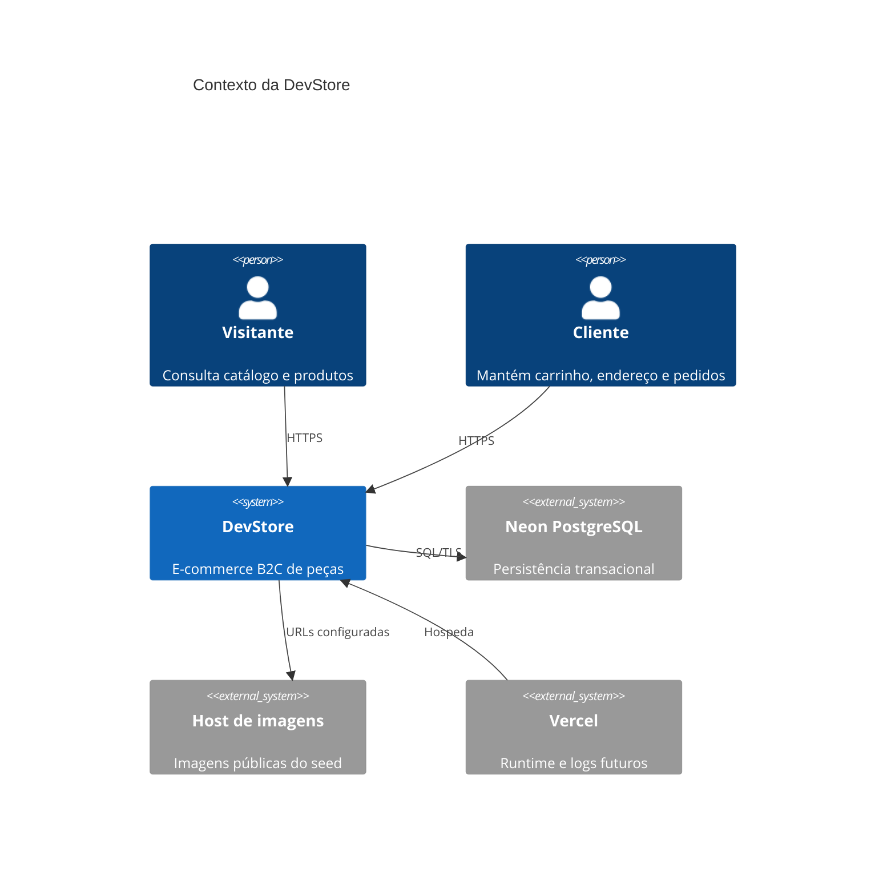
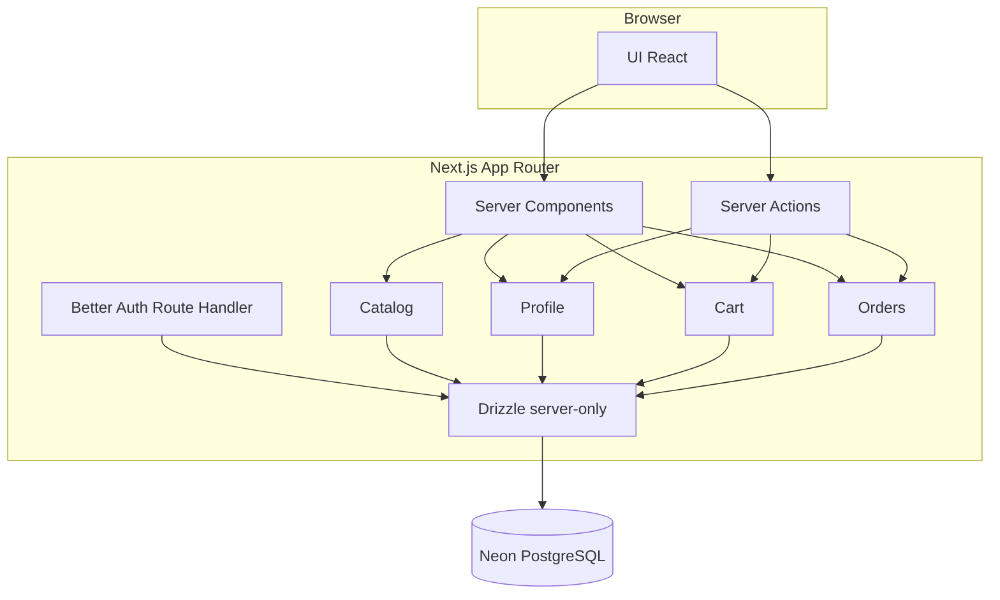
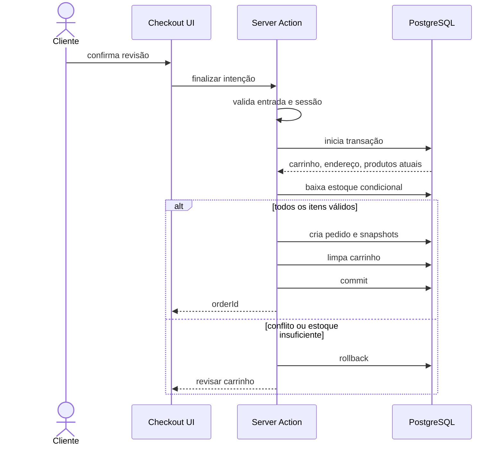
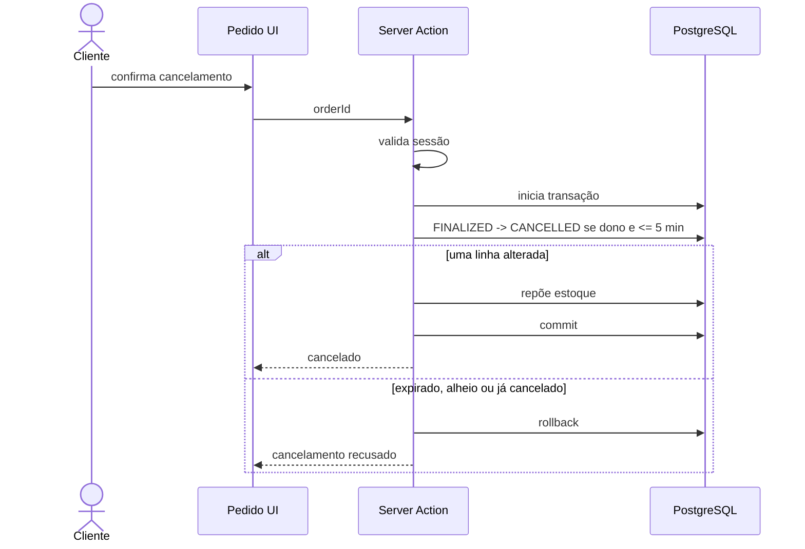
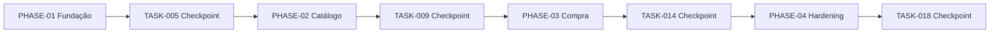

# Diagramas da DevStore

## Contexto

```mermaid
C4Context
    title Contexto da DevStore
    Person(visitor, "Visitante", "Consulta catálogo e produtos")
    Person(customer, "Cliente", "Mantém carrinho, endereço e pedidos")
    System(devstore, "DevStore", "E-commerce B2C de peças")
    System_Ext(neon, "Neon PostgreSQL", "Persistência transacional")
    System_Ext(images, "Host de imagens", "Imagens públicas do seed")
    System_Ext(vercel, "Vercel", "Runtime e logs futuros")
    Rel(visitor, devstore, "HTTPS")
    Rel(customer, devstore, "HTTPS")
    Rel(devstore, neon, "SQL/TLS")
    Rel(devstore, images, "URLs configuradas")
    Rel(vercel, devstore, "Hospeda")
```

## Componentes

```mermaid
flowchart TB
    subgraph Browser
        UI[UI React]
    end
    subgraph Next[Next.js App Router]
        Pages[Server Components]
        Actions[Server Actions]
        Auth[Better Auth Route Handler]
        Catalog[Catalog]
        Profile[Profile]
        Cart[Cart]
        Orders[Orders]
        DB[Drizzle server-only]
    end
    PG[(Neon PostgreSQL)]
    UI --> Pages
    UI --> Actions
    Pages --> Catalog
    Pages --> Profile
    Pages --> Cart
    Pages --> Orders
    Actions --> Profile
    Actions --> Cart
    Actions --> Orders
    Auth --> DB
    Catalog --> DB
    Profile --> DB
    Cart --> DB
    Orders --> DB
    DB --> PG
```

## Checkout

```mermaid
sequenceDiagram
    actor C as Cliente
    participant UI as Checkout UI
    participant A as Server Action
    participant DB as PostgreSQL
    C->>UI: confirma revisão
    UI->>A: finalizar intenção
    A->>A: valida entrada e sessão
    A->>DB: inicia transação
    DB-->>A: carrinho, endereço, produtos atuais
    A->>DB: baixa estoque condicional
    alt todos os itens válidos
        A->>DB: cria pedido e snapshots
        A->>DB: limpa carrinho
        A->>DB: commit
        A-->>UI: orderId
    else conflito ou estoque insuficiente
        A->>DB: rollback
        A-->>UI: revisar carrinho
    end
```

## Cancelamento

```mermaid
sequenceDiagram
    actor C as Cliente
    participant UI as Pedido UI
    participant A as Server Action
    participant DB as PostgreSQL
    C->>UI: confirma cancelamento
    UI->>A: orderId
    A->>A: valida sessão
    A->>DB: inicia transação
    A->>DB: FINALIZED -> CANCELLED se dono e <= 5 min
    alt uma linha alterada
        A->>DB: repõe estoque
        A->>DB: commit
        A-->>UI: cancelado
    else expirado, alheio ou já cancelado
        A->>DB: rollback
        A-->>UI: cancelamento recusado
    end
```

## Dependências das fases

```mermaid
flowchart LR
    P1[PHASE-01 Fundação] --> C1[TASK-005 Checkpoint]
    C1 --> P2[PHASE-02 Catálogo]
    P2 --> C2[TASK-009 Checkpoint]
    C2 --> P3[PHASE-03 Compra]
    P3 --> C3[TASK-014 Checkpoint]
    C3 --> P4[PHASE-04 Hardening]
    P4 --> C4[TASK-018 Checkpoint]
```
